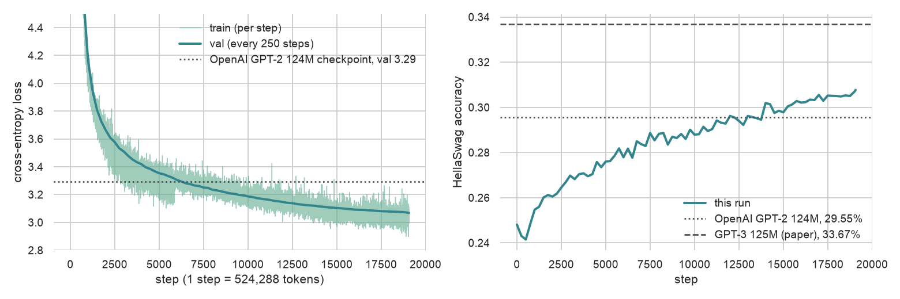

# GPT from scratch

Reproduction of GPT-2 (124M) in PyTorch, trained from scratch on 10B tokens of FineWeb-Edu on 8x A100 80GB, and benchmarked against the OpenAI checkpoint and the GPT-3 paper on HellaSwag.

## Model

- 124M params: 12 layers, 12 heads, n_embd 768, context length 1024, vocab 50257 padded to 50304 for tensor-core alignment
- Decoder-only transformer, pre-norm, learned positional embeddings, tied input/output embeddings, GELU (tanh) MLP
- GPT-2 init: N(0, 0.02), residual projections scaled by 1/sqrt(2 * n_layer)
- `from_pretrained` loads the Hugging Face GPT-2 weights into the same module layout, used to validate the architecture before training

## Data

FineWeb-Edu `sample-10BT`, tokenized with the GPT-2 BPE (`fineweb.py`) into 100 shards of 100M uint16 tokens. Shard 0 is validation, the rest is training. `DataLoaderLite` streams contiguous (B, T) windows, each DDP rank striding over the shards at its own offset.

## Training

| | |
|---|---|
| Hardware | 8x A100 80GB (one node), `torchrun --standalone --nproc_per_node=8` |
| Batch | 524,288 tokens per step (B=32, T=1024, 8 ranks, 2 gradient accumulation steps) |
| Steps | 19,073 = one pass over 10B tokens |
| Optimizer | AdamW, betas (0.9, 0.95), weight decay 0.1 on 2D params only, fused kernel |
| LR | 6e-4 peak, 715 warmup steps, cosine decay to 6e-5 |
| Grad clipping | global norm 1.0 |
| Precision | bf16 autocast, TF32 matmuls, `torch.compile`, flash attention via `F.scaled_dot_product_attention` |
| Eval | val loss (20 batches) and HellaSwag (10,042 val examples, completion style) every 250 steps |

Schedule follows GPT-3 Small (125M): 0.5M-token batch, 375M warmup tokens.

## Results



| step | val loss | HellaSwag acc |
|------|----------|---------------|
| 0 | 10.95 | 24.8% |
| 5,000 | 3.35 | 27.6% |
| 10,000 | 3.19 | 28.8% |
| 15,000 | 3.10 | 29.8% |
| 19,072 | 3.07 | 30.8% |

References, same eval script: OpenAI GPT-2 124M checkpoint val loss 3.29 and HellaSwag 29.6%; GPT-3 125M (paper) HellaSwag 33.7%.

The run passes the GPT-2 checkpoint's val loss at step 6,500 and its HellaSwag accuracy at step 12,000, with 10B tokens against GPT-2's 100B (WebText) and GPT-3's 300B. Val loss is on FineWeb-Edu, so the gap to the OpenAI checkpoint partly reflects data mismatch. HellaSwag is the dataset-independent comparison.

Raw log: `log124M_10B/log.txt` (train loss per step, val and HellaSwag every 250).

## Files

| | |
|---|---|
| `train_gpt2.py` | model, data loader, optimizer config, DDP training loop, evals, checkpointing |
| `fineweb.py` | downloads and tokenizes FineWeb-Edu into shards |
| `hellaswag.py` | HellaSwag download and completion-style eval, also runs standalone on Hugging Face GPT-2 checkpoints |
| `setup_gpu.sh` | bootstraps a fresh Ubuntu GPU box: uv, gh, git identity, deps |
| `plot_log.py`, `plot.ipynb` | render the training log into the figure above |
| `scratchpad.ipynb` | inspecting the Hugging Face GPT-2 weights, early single-GPU runs on Tiny Shakespeare |

## Run

```bash
bash setup_gpu.sh                                   # fresh GPU box
uv run fineweb.py                                   # ~20 GB of shards into edu_fineweb10B/
uv run torchrun --standalone --nproc_per_node=8 train_gpt2.py
uv run hellaswag.py -m gpt2 -d cuda                 # reference number for the OpenAI checkpoint
uv run --with seaborn plot_log.py                   # assets/training_curves.png from the log
```

Checkpoints land in `log/model_{step}.pt` every 5,000 steps.

## License

MIT

## AI statement

No AI was used to write the code. Claude Code (Fable 5.1) drafted and edited this README and wrote `plot_log.py`. Cursor (GPT-5.6 (sol, medium)) reviewed and refined my handwritten notes and comments in the code and notebooks.
